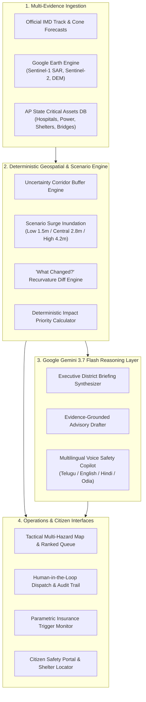

# 🌀 ZATICS v3.0 // Cyclone Impact Forecaster
### *AI-Powered Geospatial Anticipatory Action & Infrastructure Preparedness Platform*

[](https://python.org)
[](https://fastapi.tiangolo.com)
[](https://deepmind.google/technologies/gemini/)
[](https://earthengine.google.com/)
[](LICENSE)

---

## 🌟 Executive Summary

Tropical cyclones in the **Bay of Bengal and North Indian Ocean** threaten over **250 million coastal citizens**, vital power grids, trauma hospitals, and transport lifelines. While meteorological agencies like the **India Meteorological Department (IMD)** produce high-precision atmospheric track forecasts, district disaster management authorities (DDMAs) face an **anticipatory action gap**: *converting an evolving meteorological trajectory into prioritized, asset-specific infrastructure preparedness interventions before landfall.*

**ZATICS v3.0 (Cyclone Impact Forecaster)** bridges this critical gap by fusing:
1. **Official Meteorological Feeds:** IMD track updates, lead times, wind radii, and central pressure.
2. **Google Earth Engine (GEE) Earth Intelligence:** Sentinel-1 Synthetic Aperture Radar (SAR) flood masks, Sentinel-2 built-up indicators, and SRTM 30m Digital Elevation Models (DEM).
3. **Deterministic Mathematical Scoring:** Explainable, transparent prioritization formula ($0 \le \text{ImpactPriority} \le 100$) evaluating hazard, vulnerability, consequence, and access.
4. **Google Gemini 3.7 Flash Multimodal AI:** Evidence-grounded executive briefings, localized multi-stakeholder advisories with **Human-in-the-Loop approval**, and multilingual voice-enabled citizen safety copilots.
5. **Parametric Insurance Readiness:** Real-time policy trigger monitoring for rapid humanitarian liquidity release.

---

## 🏗️ Architecture & Data Flow



---

## 📐 Deterministic Mathematical Formulation

Unlike "black-box" models, ZATICS evaluates every critical infrastructure asset using an open, auditable formula:

$$\text{ImpactPriority}(a,t) = 0.35 \times \text{HazardExposure} + 0.25 \times \text{Vulnerability} + 0.20 \times \text{Consequence} + 0.10 \times \text{AccessCriticality} + 0.10 \times \text{DataConfidence}$$

### Factor Decomposition:
* **Hazard Exposure ($0.35$):** Combines distance from track centerline, uncertainty buffer position, maximum wind speed radius, storm surge flood overlay, and rainfall accumulation.
* **Vulnerability ($0.25$):** Evaluates asset terrain elevation from SRTM DEM, physical structural fragility, and backup generator (DG) availability.
* **Consequence ($0.20$):** Weighted by asset criticality tier (ICU beds, grid MW throughput, population served).
* **Access Criticality ($0.10$):** Disruption probability of primary and feeder bridges/access corridors based on rainfall pathway modeling.
* **Data Confidence ($0.10$):** Freshness penalty for assets with outdated or unverified backup power records, incentivizing pre-cyclone inspections.

---

## ✨ Key Platform Features

| Capability | Technical Implementation | Operational Value |
| :--- | :--- | :--- |
| **Tactical Multi-Hazard Map** | Leaflet with DarkMatter base, GeoJSON surge cones, GEE SAR radar masks | Real-time situational awareness across coastal Andhra Pradesh |
| **"What Changed?" Diff Engine** | Vector diffing between sequential forecast updates ($t_1 \rightarrow t_3$) | Instantly detects assets newly escalated due to track recurvature |
| **Human-in-the-Loop Advisory** | Gemini 3.7 Flash drafting + Incident Commander authorization | Eliminates AI hallucination risks with cryptographic audit trail |
| **Parametric Insurance Readiness** | Automated threshold monitoring (Wind $>130\text{ km/h}$, Surge $>3.0\text{m}$) | Accelerates post-event humanitarian liquidity disbursement |
| **Multilingual Voice Copilot** | Web Speech API + Gemini localized guidance (Telugu, English, Hindi, Odia) | High-accessibility life-saving instructions for low-literacy citizens |
| **Executive District Briefing** | Structured Markdown & PDF export for District Collectors | One-click DDMA coordination document generation |

---

## 🚀 Quickstart & One-Command Launch

### Prerequisites
* Python 3.10+
* Google Gemini API Key (optional, defaults to deterministic fallback if not set)

```bash
# Clone the repository
git clone https://github.com/your-org/cyclone-impact-forecaster.git
cd cyclone-impact-forecaster

# Set Gemini API Key (Optional)
export GEMINI_API_KEY="your-gemini-api-key"

# Single-Command Setup & Launch
python run.py
```

Open your browser to **`http://127.0.0.1:8000`** to access the tactical operations dashboard.

---

## 🧪 Automated Test Suite

Run the full verification suite covering all 10 analytical modules:

```bash
python test_backend.py
```

---

## ⏱️ 5-Minute Judge Walkthrough Script

1. **0:00 - 0:45 | The Challenge**: Open the dashboard. Explain that when Cyclone JAWHAR forms in the Bay of Bengal, District Collectors cannot easily interpret atmospheric track coordinates to protect hospitals and power grids.
2. **0:45 - 1:45 | Tactical Map & Scored Queue**: Point out the dark Leaflet map showing the cyclone eye, uncertainty corridor, and GEE Sentinel-1 SAR inundation mask. Show the ranked queue of 38+ infrastructure assets with 5-factor progress strips.
3. **1:45 - 2:45 | Track Recurvature & "What Changed?"**: Switch from **Update 01** to **Update 03**. Click **"⚡ What Changed?"**. Show how a 38km NE recurvature immediately escalates King George Hospital (Visakhapatnam) and Machilipatnam Substation into *Immediate Attention* (+22 pts).
4. **2:45 - 3:45 | Gemini Advisory with Human-in-the-Loop**: Click **"🤖 AI Advisory"**. Show Gemini 3.7 Flash drafting an evidence-grounded bulletin. Demonstrate the District Collector's sign-off and click **"Approve & Dispatch"**, viewing the verified audit receipt.
5. **3:45 - 4:30 | Parametric Insurance & Citizen Voice**: Open **"🛡️ Parametric Insurance"** to show real-time trigger breach signals. Open **"🚨 Citizen Portal"**, select Telugu, and click **"🔊 Listen to Voice Audio"** to demonstrate Web Speech API voice synthesis.
6. **4:30 - 5:00 | Impact & Scalability**: Highlight deployability across India's 7,500km coastline and transferability to BRICS coastal nations (Bangladesh, Mozambique, Brazil).

---

## 📊 10-Slide Pitch Deck Outline

* **Slide 1: Title & Vision** — ZATICS v3.0: Converting Cyclone Forecasts into Anticipatory Infrastructure Action.
* **Slide 2: The Problem** — 250M coastal citizens at risk; atmospheric forecasts lack actionable infrastructure prioritization.
* **Slide 3: The Solution** — Multi-evidence fusion: IMD + Google Earth Engine + Gemini 3.7 Flash.
* **Slide 4: Mathematical Scoring** — 5-factor deterministic formula ($0-100$) ensuring auditable, transparent decision-making.
* **Slide 5: Google AI Integration** — Gemini 3.7 Flash for executive briefings, grounded advisories, and multilingual citizen copilot.
* **Slide 6: Human-in-the-Loop & Governance** — Incident commander sign-off, dispatch audit trails, and zero unauthorized broadcasting.
* **Slide 7: Parametric Insurance Innovation** — Instant payout-readiness signals for post-disaster liquidity.
* **Slide 8: Inclusivity & Voice Accessibility** — Voice-enabled guidance in Telugu, English, Hindi, and Odia for last-mile safety.
* **Slide 9: Real-World Pilot Strategy** — Deployment blueprint for Andhra Pradesh DDMA (Visakhapatnam to Bapatla).
* **Slide 10: Scalability & BRICS Impact** — Modular architecture scaling across coastal India and tropical cyclone basins globally.

---

## 📄 License & Attribution

* Built for the Disaster Resilience & Geospatial Intelligence Hackathon.
* Open-source components: Leaflet.js, FastAPI, Shapely, SQLite3.
* Powered by **Google Gemini API** & **Google Earth Engine**.
